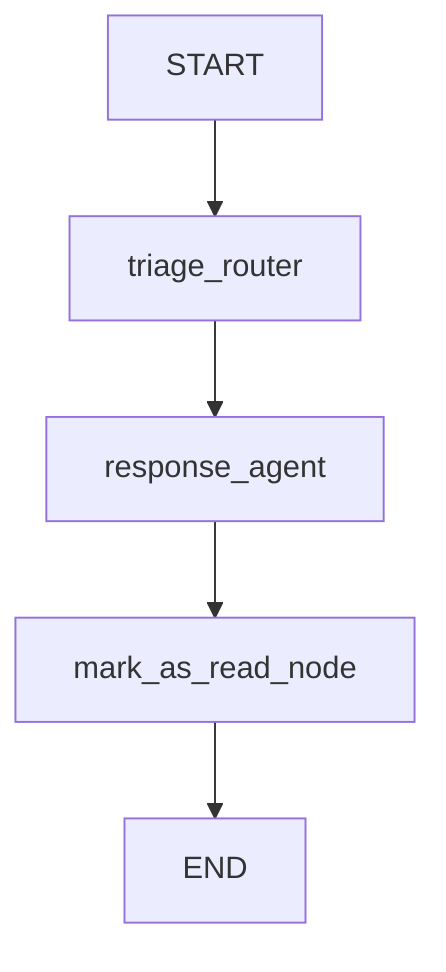
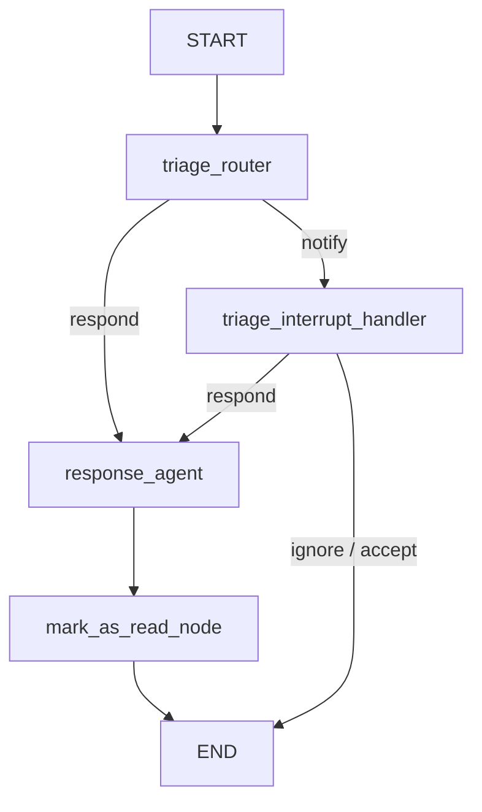
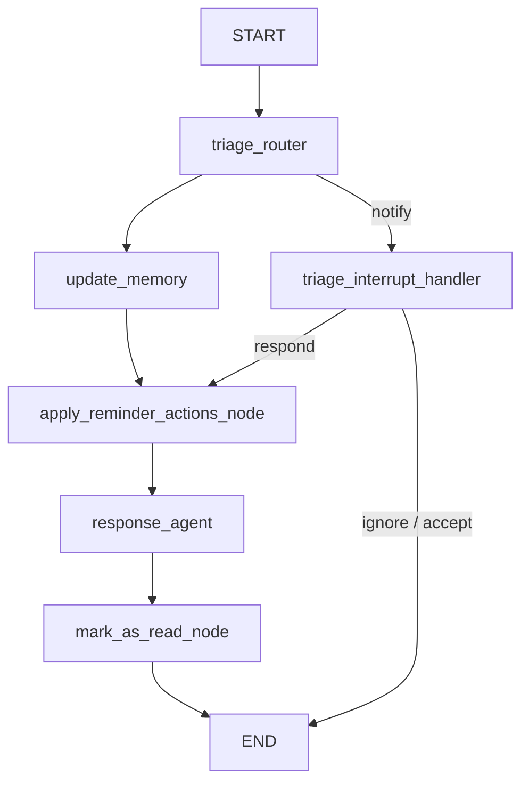
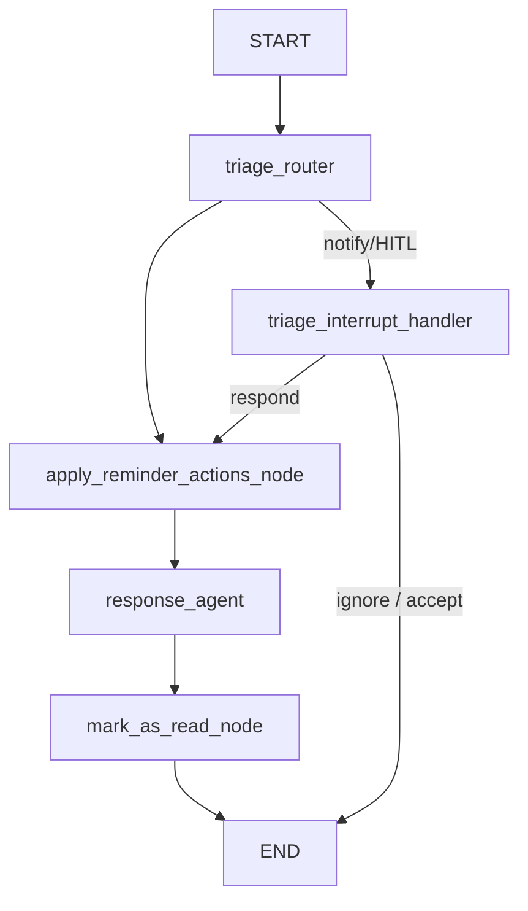

# Agent Diagrams

This reference collects Mermaid diagrams for each LangGraph workflow included in the project. All graphs use sync durability checkpoints and share the same reminder dispatcher primitives; arrows focus on high-level routing.

## `email_assistant`

## `email_assistant_hitl`

## `email_assistant_hitl_memory`

## `email_assistant_hitl_memory_gmail`

